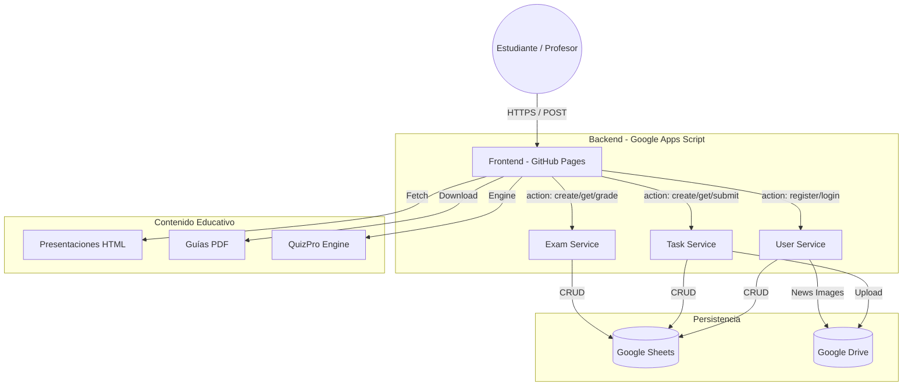

# Plataforma de Gestión Educativa (PWA) - ISEMED Área de Informática

## 1. Arquitectura General
La plataforma es una **Aplicación Web Progresiva (PWA)** diseñada bajo una arquitectura de **Microservicios desacoplados** que interactúan mediante una capa de transporte de datos en formato JSON.

### Componentes de la Arquitectura:
- **Frontend (SPA)**: Desarrollado en HTML5, CSS3 (Tailwind CSS) y JavaScript Vanilla (ES6+). Alojado en GitHub Pages.
- **Backend (Microservicios)**: Tres servicios independientes ejecutados en **Google Apps Script (GAS)** que actúan como API RESTful simplificada.
- **Base de Datos (Persistencia)**:
  - **Google Sheets**: Almacenamiento relacional para usuarios, tareas, entregas y analíticas.
  - **Google Drive**: Almacenamiento de archivos binarios (evidencias de estudiantes, imágenes de noticias).

---

## 2. Diagrama de la Plataforma (Organigrama)

---

## 3. Estructura de Archivos y Responsabilidades

### 3.1. Frontend (Directorio Raíz y `/js`)
- **`index.html`**: Punto de entrada público. Gestiona noticias y el portal de contenidos.
- **`student-dashboard.html`**: Panel del alumno. Visualización de expediente y entrega de tareas.
- **`teacher-dashboard.html`**: Panel del docente. Gestión de actividades, calificación y reportes.
- **`pseudocode.html`**: Editor de pseudocódigo integrado (intérprete compatible con PSeInt).
- **`js/config.js`**: Configuración central (URLs de microservicios y parcial actual).
- **`js/api.js`**: Helper `fetchApi` unificado para comunicación con el backend.
- **`js/ui-common.js`**: Lógica compartida: encabezados institucionales, sistema de navegación History API y modales globales.
- **`js/quizpro.js`**: Motor de evaluación inteligente. Extrae preguntas de archivos HTML y procesa la lógica de juego.
- **`js/student.js` & `js/teacher.js`**: Controladores específicos de cada dashboard.

### 3.2. Juegos y Actividades (`/juegos`)
- **`quizpro.html`**: Interfaz de evaluación dinámica.
- **`perifericos.html`**: Minijuego de clasificación de hardware.
- **`webmaster_quiz.html`**: Cuestionario interactivo de diseño web.
- **`destreza_teclado.html`**: Herramienta de medición de velocidad de escritura.

### 3.3. Backend (`/backend`)
Cada subdirectorio (`user-service`, `task-service`, `exam-service`) contiene un archivo `Code.gs` listo para ser desplegado en Google Apps Script.

---

## 4. Estructura de la Base de Datos (Google Sheets)

### Hoja: `Usuarios`
| Campo | Tipo | Descripción |
| :--- | :--- | :--- |
| `userId` | String | ID único USR-TIMESTAMP. |
| `nombre` | String | Nombre completo del usuario. |
| `grado` | String | Décimo, Undécimo, Duodécimo. |
| `seccion` | String | A, B, etc. |
| `email` | String | Identificador de inicio de sesión. |
| `hashedPassword` | String | Hash SHA-256 de la contraseña. |
| `rol` | String | 'Estudiante' o 'Profesor'. |
| `telefono` | String | WhatsApp del usuario. |
| `numeroLista` | String | Orden asignado en la sección. |

### Hoja: `Tareas` / `Examenes`
| Campo | Descripción |
| :--- | :--- |
| `tareaId` / `examenId` | Identificador único de la actividad. |
| `tipo` | Tarea, Credito Extra o Examen. |
| `titulo` | Nombre de la actividad. |
| `descripcion` | Contenido en formato HTML (Quill). |
| `parcial` | Periodo académico correspondiente. |
| `asignatura` | Materia vinculada. |
| `fechaLimite` | Timestamp de cierre. |

### Hoja: `Logros`
Registra el historial de minijuegos para la progresión académica y ranking.
Columnas: `[Fecha, UserId, Alumno, Juego, Asignatura, Puntaje, Nivel, Grado]`.

---

## 5. Funciones y APIs Críticas

### 5.1. Sistema de Navegación (History API)
Ubicado en `js/ui-common.js`, permite que los modales y pestañas del dashboard funcionen con los botones "Atrás/Adelante" del navegador.
- `history.pushState`: Registra un cambio de vista o apertura de modal.
- `window.addEventListener('popstate')`: Sincroniza la UI al navegar por el historial.

### 5.2. Motor QuizPro (`quizpro.js`)
- `processPresentation()`: Escanea archivos HTML externos buscando `const quizData` o bloques `concept-box` para generar preguntas en tiempo real.
- `checkCrossGradeLock()`: Valida que el estudiante haya aprobado (>=70%) todas las materias del grado anterior antes de permitir el acceso.

### 5.3. Subida de Archivos Pesados (`student.js`)
Implementa **Chunked Upload** para superar el límite de 50MB de Google Apps Script.
- `uploadChunk`: Envía fragmentos de 2MB.
- `finishChunkedUpload`: Reensambla los fragmentos en el servidor.

### 5.4. Seguridad
- **Hashing**: Las contraseñas nunca viajan ni se almacenan en texto plano (SHA-256 en cliente y servidor).
- **Scope Guard**: `isContentAuthorized()` en `js/config.js` restringe la visibilidad del contenido según el parcial configurado globalmente.

---

## 6. Servicios de Backend (Acciones)

### `USER-SERVICE`
- `loginUser`: Autenticación por email o nombre.
- `updateUserProfile`: Actualización atómica de datos de perfil.
- `saveGameResult`: Persistencia de récords en minijuegos.
- `getGlobalTop`: (En proceso) Cálculo de promedios para el ranking mundial.

### `TASK-SERVICE` / `EXAM-SERVICE`
- `getStudentTasks`: Obtiene tareas cruzando datos con entregas del usuario.
- `submitAssignment`: Crea carpetas jerárquicas en Drive `(Grado/Seccion/Alumno/Asignatura)` y guarda el archivo.
- `gradeSubmission`: Actualiza nota y comentarios del docente.

---

## 7. Proceso de Actualización
Cualquier cambio en los archivos `.js` debe incrementar el parámetro de versión `?v=X` en los llamados de los archivos `.html` para invalidar la caché del navegador de los estudiantes.
