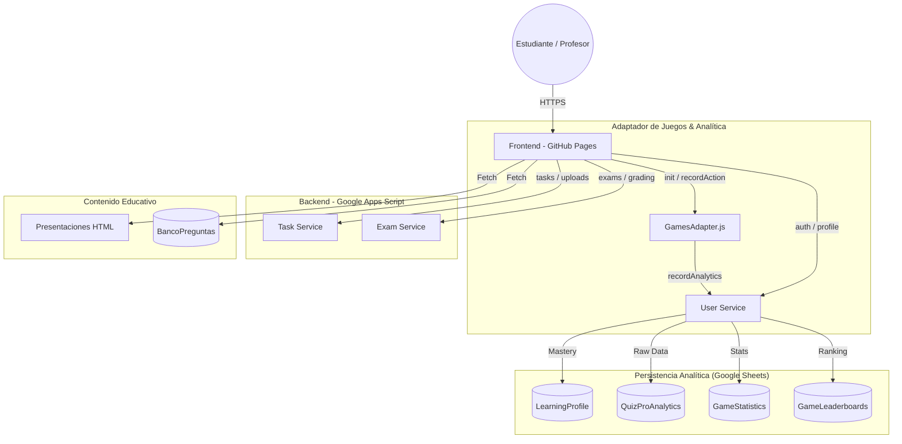

# Plataforma de Gestión Educativa (PWA) - ISEMED Área de Informática

## 1. Arquitectura General
La plataforma es una **Aplicación Web Progresiva (PWA)** diseñada bajo una arquitectura de **Microservicios desacoplados** que interactúan mediante una capa de transporte de datos en formato JSON.

### Componentes de la Arquitectura:
- **Frontend (SPA)**: Desarrollado en HTML5, CSS3 (Tailwind CSS) y JavaScript Vanilla (ES6+). Alojado en GitHub Pages.
- **Backend (Microservicios)**: Servicios independientes ejecutados en **Google Apps Script (GAS)** que actúan como API RESTful.
- **Base de Datos (Persistencia)**:
  - **Google Sheets**: Almacenamiento relacional para usuarios, tareas, entregas y analíticas avanzadas.
  - **Google Drive**: Almacenamiento de archivos binarios (evidencias, imágenes).

---

## 2. Diagrama de la Plataforma (Ecosistema Integral)

---

## 3. Estructura de Archivos y Responsabilidades

### 3.1. Frontend (Directorio Raíz y `/js`)
- **`index.html`**: Punto de entrada. Gestión de noticias y portal de contenidos.
- **`js/games-adapter.js`**: **(Nuevo)** Adaptador unificado para minijuegos. Gestiona pantallas de carga, pre-carga de rankings y captura de comportamiento.
- **`js/quizpro.js`**: Motor de evaluación inteligente. Soporta múltiples modalidades (Matching, Ordering, Memory, Transcription).
- **`js/config.js`**: Configuración central y Guardianes de Alcance (`isContentAuthorized`).
- **`js/api.js`**: Helper `fetchApi` unificado.

### 3.2. Juegos y Actividades (`/juegos`)
- **`quizpro.html`**: Interfaz de evaluación dinámica.
- **`perifericos.html`**: Minijuego de hardware (Rediseño Tailwind v4).
- **`webmaster_quiz.html`**: Cuestionario de diseño web (Rediseño Tailwind v4).

---

## 4. Estructura de la Base de Datos (Evolución Analítica)

### Hoja: `QuizProAnalytics`
Registra cada interacción individual para análisis de patrones.
| Columna | Descripción |
| :--- | :--- |
| `analyticsId` | ID único del evento. |
| `esCorrecta` | Booleano de acierto. |
| `tiempoRespuesta` | Tiempo en ms. |
| `indiceConfianza` | Cálculo basado en rapidez y precisión. |
| `indiceAdivinacion` | Detección de respuestas aleatorias (tiempo extrem. rápido). |

### Hoja: `LearningProfile`
Corazón del sistema de dominio por concepto.
| Columna | Descripción |
| :--- | :--- |
| `userId` | ID del estudiante. |
| `tema` | Concepto específico (ej. "Algoritmos", "Selectores CSS"). |
| `intentos / aciertos` | Contadores acumulados. |
| `indiceDominio` | Promedio ponderado (70% histórico / 30% actual). |

### Hoja: `BancoPreguntas`
Repositorio centralizado de reactivos para todos los minijuegos.
| Columna | Descripción |
| :--- | :--- |
| `TipoActividad` | multiple_choice, ordering, matching, memory, transcription. |
| `Asignatura / Nivel` | Metadatos para filtrado y progresión. |

---

## 5. Fórmulas y Métricas Educativas

### 5.1. Índice de Confianza (90-100: Muy Alto)
Calculado mediante la relación entre el **Tiempo de Respuesta** y el **Tiempo Promedio Histórico**, penalizando cambios de respuesta y recompensando la precisión.

### 5.2. Índice de Dominio (Mastery)
Utiliza un **Promedio Ponderado de Movimiento**:
`NuevoDominio = (DominioHistorico * 0.7) + (DominioActual * 0.3)`
Esto permite que el perfil del estudiante refleje su progreso real, dando más peso a sus ejecuciones más recientes sin ignorar su consistencia previa.

### 5.3. Reglas de Desbloqueo (Fase 13)
- **Nivel Intermedio**: Nota >= 70% AND Índice de Dominio >= 60.
- **Nivel Avanzado**: Nota >= 70% AND Índice de Dominio >= 70.
- **Grado Superior**: Requiere aprobación de TODAS las materias del grado anterior con los criterios anteriores.

---

## 6. Servicios de Backend (User Service)
- `recordAnalytics`: Procesa métricas de comportamiento y las persiste.
- `updateLearningProfile`: Actualiza el dominio por concepto atómicamente.
- `getGlobalTop`: Calcula rankings basados en el promedio de niveles.
- `getQuestionBank`: Entrega reactivos filtrados por asignatura y nivel.

---

## 7. Proceso de Limpieza y Mantenimiento
- Los archivos `.txt` huérfanos y scripts `.py` de agentes previos deben ser eliminados periódicamente.
- Las imágenes en `NoticiasPortal` deben ser URLs directas (`lh3.googleusercontent.com/d/ID`) para optimizar carga.
